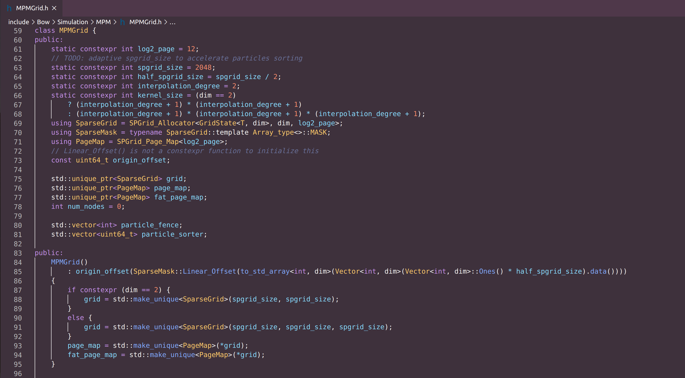
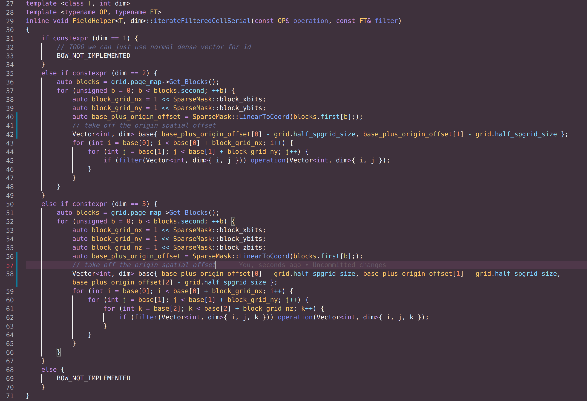

## Simple introduction to the usage of SPGrid in BOW

### The motivation for using SPGrid

In the physical simulation, the access to the data attributes encoded in the structural grid is usually not random. Sometimes, We need to access and modify the data in a specific grid along with its adjacent grids (I.E. kernel); We also grab the data from a specific grid along with its adjacent grids and fill it into a coefficient matrix (I.E. stencil); We can also iterate by a certain sweep ordering and push the data into an iostream (I.E. stream). All these examples require accessing data in grids that are somewhat spatially close.

Being spatially close doesn't necessarily equal being close in the memory. Take a simple example: we use a 4-floats (16 bytes) array to represent the conserved variables $q=(\rho,\rho u, \rho v, \rho w)$ of an isothermal Euler gas system.  If the domain size is $512^3$ and, naive align ordering (x-slowest-z-fastest) is applied.

In the context of the finite volume method, a technique called flux reconstruction is usually used to obtain the number of conserved variables transferred into a grid via its interface. For example, the 3rd-order ENO method, without more derivation details, essentially takes $q$ in 5 adjacent grids in one direction to fill two stencils, and repeat for each direction. The byte offsets between the 1st and the 5th grid value will be $16 \times 4 =64$ in the x-direction, $16 \times 4 \times 512 = 32768$ in the y-direction, and $16 \times 4 \times 512 \times 512= 16777216$, **4096** pages, in the z-direction.

The significant page offsets will dramatically slow down this and similar passes and essentially the whole program, hence, a technique is needed for fast queries of these spatial grids. Also in many scenarios, sparsity is desired to simplify and accelerate the iteration process. Among many existing techniques such as spatial filling curve, spatial hash, VDB, and SPGrid, we simply introduce **SPGrid** here.

### Structure of the SPGrid

SPGrid sequentially allocates $N^{dim}$ entries of your self-defined **GridState** in the memory. The $N$ is the maximum possible spatial index in one direction and is set to be $2048$ in the template screenshot. Here note that in this class you will heavily use its instances of the **SparseGrid** to get access to the real stored array of GridState data, the **SparseMask** to get useful constants related to the spgrid and perform offset translations, and the **SPGrid_Page_Map** to record and iterate those touched blocks.

The simple concept of the SPGrid is that the whole grid field is grouped and divided into continuing **blocks**, whereas in each block the grids are ordered using a naive fashion. Each block's total size is designed to fill exactly a 4KB memory page size (log_2_page = 12), then the spatial index size inside each block can be determined by the GridState's size. Take the conserved variables $q$ as an example, if $q$ is the only channel stored in the GridState, the total entries in a block is $4096 / 16 = 256$, which yields $4 \times 8 \times 8$ indices in each direction. Hence, even for high order stencil access like 3rd-ENO, it happens within one block for most of the time with no more than 1-page offset. Even for grids near the block boundary, the offset is acceptable as the access does cross no more than 1 blocks: see the **node15** in the screenshot (https://dl.acm.org/doi/10.1145/2661229.2661269) below, also it is great for understanding the binary representation of the geometry coordinates, how it connects with the data bits, and how the frequently used bitwise shift operator is connected to getting the correct linear offset.

### Setup your GridState

Note that the size of a GridState must be $2^{int}$ bytes. In cases where your data size is not, use zero paddings to up-round the total size. Note that we can use use the **std::condition** to set the proper padding type the same size as your template GridState's identifier.

### Define the bracket access

Define bracket access makes accessing like domain sweeping, and kernel iteration much easier, which is easily defined by the translation from the spatial indices to the linear offset.

  

### Reset the topology of the grid

The page_map is a bitmap for handling all the touched blocks in your SPGrid. Every time the topology of your sparse array may be changed (I.E. after the particles have been advected), a reset process is needed to record the correct offsets only for those touched blocks. So that no time wastes in iterating non-active grids.

A typical pipeline of resetting the topology is shown in the screenshot below (here field_helper.grid is an instance of a SPGrid class similar to the MPMGrid shown in the above screenshot): 

1. Clear the currently recorded blocks
2. For each grid you want to touch, translate its spatial index into the linear offset, biased_offset. Here biased_offset means relative to the spatial origin.
3. Use SparseMask::Packed_Add to get the real offset to the channel base, as the spatial origin is moved to the linear center of the whole memory segment of the SPGrid in this example.
4. Set_Page(offset)
5. Update_block_offsets()

Following the pipeline, it's easy to see in the above screenshot one sets all grids in a bounding box (with -2/+2 ghost layers) to be active and touches the corresponding blocks.

### DIY iterating process

With the page_map already reset, you can easily call the function **Get_Blocks()** in **SPGrid_Page_Map** class. The return is the linear offset for the beginning of all touched/active blocks, paired with the number of them. The outer loop is throughout each active block, while the inner loop is trivial as the ordering of entries is in the naive fashion.

You can also utilize useful constants like **SparseMask::elements_per_block** to clean the code if the spatial index is unimportant in your case.

In the case of parallel looping, if the operation only applies on the grid, then you can simply change the outer loop to be parallel; otherwise, in the case of kernel iteration, you may need to design your atomic operation, or algorithms such as colored looping to avoid data racing.

### Use SPGrid as an index hint

There are also cases that the GridState's size is too large if we store all the possible encoding values, which limits the total entries in a block and increases the possibility for larger linear offsets because accessing can cross multiple blocks.

Take a simple single-phase 3-D Euler system as an example, considering the energy equation this time; we use implicit method (requiring the mapping between spatial index and the dofs in the linear system), and we also want to apply the 3rd-order Runge-Kutta method for higher temporal resolution. In this scenario, the conserved variables also include the enthalpy, so $q=(\rho, e, \rho u, \rho v, \rho w)$, also at least 3 caches $q_0,q_1,q_2$ are needed for completing the sub-steps; The linear mapping between the spatial and the dof indices are $id_u, id_P, id_Y$, for the velocity node, the staggering pressure node, and the boundary constraints are needed for implicit method.

The total size will be $3 \times 5 \times 4 + 3 \times 4 = 72$ , up-round to 128 bytes for 32-bits types, and $144$, up-round to 256 bytes for 64-bits types. In this case, the max indices in a block is $2 \times 4 \times 4$, and $2 \times 2 \times 4$, respectively. For higher-order stencil filling such as 3rd-ENO, the access may cross more than one block, increasing the linear offsets. Not to mention that for the multi-phase simulations, one copy of the above states is needed for every other phase; along with the volume fraction of each phase.

Hence, the more reasonable choice should be using the SPGrid to store only the important indices and ordering the data stored in an external container according to these indices. Although we can no longer access spatially close grids in one continuous segment of memory, this can still be achieved by accessing two continuous segments.

The following screenshot shows an example for a gas-solid simulation in a dense square-shaped grid field: all the variables are stored in an external container whose size is the same as background mesh (I.E. $256^3$), and the idx is the linear mapping from spatial indices to idx, the ordering of the external container, which does not to change since this is not a sparsed domain. The idu, idP, idY, idH are the linear mapping from the spatial indices to the id of the dofs, which changes as the solid moves around and the pattern of the interface changes, and we can easily create the sparse systems with them recorded. The cell_type is important as its heavily used as the filter of many different passes. As the int type suffices all the channels we don't even need to make the class a template. 

